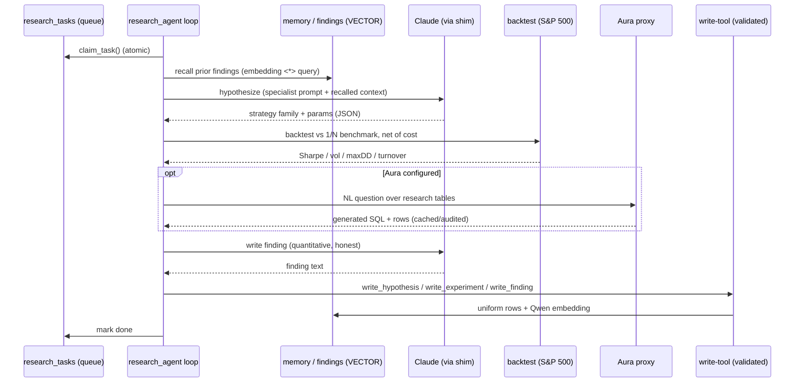

# Portfolio Agents + Autonomous Research Fleet

A two-part system on **SingleStore**, built on the
[NVIDIA portfolio-optimization blueprint](https://github.com/NVIDIA-AI-Blueprints/portfolio-optimization)
and [NVIDIA NemoClaw / OpenShell](https://github.com/NVIDIA/NemoClaw):

1. **Portfolio Agents** — a fleet of strategy agents that compete on the S&P 500 using
   **GPU-accelerated optimization** (cuOpt + cuML on an NVIDIA L4), with **persisted agent
   memory** (Qwen `VECTOR(1024)` recall) and **Goldman-style trade tracking**
   (orders → fills → positions → NAV → audit).
2. **Autonomous Research Fleet** — several **OpenClaw-through-NemoClaw** agents, each on its
   own EC2 inside NVIDIA OpenShell sandboxes, that research & backtest trading strategies and
   write findings to SingleStore **over time**, then run natural-language analytics over those
   findings through a **hosted, hardened Aura Analyst proxy**.

Everything — market prices, agent memory, trades, research hypotheses/experiments/findings,
and the Aura audit trail — lives in **one SingleStore database** (`portfolio_agents`).

> **Status:** production-grade. A safety-first hardening pass has landed — a
> fail-closed pre-trade risk gate, a fleet-wide kill switch, a paper-trading
> shadow book, an immutable audit trail, and an out-of-sample sweep that selects
> the winner honestly are all shipped and tested. Paper mode is the default
> execution sink; connecting live capital is a matter of wiring a broker adapter
> and a real-time feed — see [Production readiness](#production-readiness).

---

## Architecture

```mermaid
flowchart TB
    subgraph OP["Operator / laptop"]
        CLI["code-factory CLI<br/>+ deploy scripts"]
    end

    subgraph AWS["AWS us-east-1 · VPC vpc-282c2551"]
        subgraph GPU["GPU box · g6.2xlarge (NVIDIA L4)"]
            PA["Portfolio Agents fleet<br/>pa_agents/<br/>cuOpt + cuML optimizers"]
        end

        subgraph FLEET["Research fleet · 5x t3.xlarge"]
            direction TB
            subgraph N1["research node (x5: momentum, mean-reversion,<br/>vol-target, factor, regime)"]
                SHIM["inference-shim :11500<br/>OpenAI to Bedrock"]
                TOOL["write-tool server :11510<br/>templated, validated writes"]
                LOOP["research_agent loop<br/>claim to recall to hypothesize to<br/>backtest to analyze to finding"]
                subgraph OS["NVIDIA OpenShell sandbox"]
                    OC["OpenClaw agent<br/>(NemoClaw)"]
                end
            end
        end

        subgraph PROXY["Aura proxy · t3.small (dedicated)"]
            AP["aura_proxy :8799<br/>cache · retry · circuit-breaker ·<br/>rate-limit · audit · one key"]
        end
    end

    subgraph S2["SingleStore (S-2, managed)"]
        DB[("portfolio_agents DB<br/>prices · agent_memory (VECTOR) · trades ·<br/>research_* · aura_query_log · aura_cache")]
        LLM["Hosted Anthropic (Bedrock gw)<br/>+ Qwen embeddings"]
    end

    AURA["Aura Analyst domain<br/>(SingleStore Portal · NL to SQL)"]

    CLI -->|provision / deploy| GPU
    CLI -->|provision / deploy| FLEET
    CLI -->|provision / deploy| PROXY

    PA -->|read prices · write trades/memory| DB
    PA -->|reflections / embeddings| LLM

    OC -->|inference.local| SHIM
    SHIM -->|Bearer JWT| LLM
    OC -->|host.openshell.internal:11510| TOOL
    LOOP -->|hypotheses/experiments/findings| TOOL
    TOOL -->|validated rows + Qwen embed| DB
    LOOP -->|NL question| AP
    OC -->|NL question (egress policy)| AP
    AP -->|one shared key + audit| AURA
    AURA -->|generated SQL over| DB
    AP -->|audit + cache rows| DB

    classDef s2 fill:#5b21b6,stroke:#c4b5fd,color:#fff;
    classDef gpu fill:#3f6212,stroke:#a3e635,color:#fff;
    classDef proxy fill:#7c2d12,stroke:#fdba74,color:#fff;
    class S2,DB,LLM s2;
    class GPU,PA gpu;
    class PROXY,AP proxy;
```

### The research loop (per task, per node)



### Why the inference shim + tool server?

NemoClaw's built-in Bedrock adapter is hard-gated to real AWS hostnames, so it can't reach
the SingleStore-hosted Anthropic gateway directly. A tiny **OpenAI-compatible to Bedrock-Converse
shim** on each node bridges it. OpenShell's L7 egress proxy also blocks arbitrary host ports, so
the sandbox reaches the host **write-tool** and the **Aura proxy** only through explicit OpenShell
policy presets. Net effect: **the credential never enters the sandbox**, and **every write is
schema-validated host-side** so data stays uniform across the fleet.

### Agent-driven loop + complexity routing (NeMo Switchyard)

The research runtime is a **host-side Claude tool-use loop** (`agentic_loop.py`): the model
itself decides each action — recall prior findings, inspect the sweep, form a hypothesis, run a
**real** backtest, interpret it, **ask Aura Analyst** natural-language questions across the whole
fleet's record, and write the result — then picks the next thing. It cannot fabricate metrics
(numbers come from `run_backtest`), and it runs continuously (no queue to drain). Tools are defined
in `agent_tools.py`, including a first-class **`ask_analyst`** tool that proxies the real Aura
Analyst Portal domain (never a local NL→SQL substitute) and self-audits every call to
`research_analyst_queries`.

Model selection is handled by **[NVIDIA NeMo Switchyard](https://github.com/NVIDIA-NeMo/Switchyard)**
— its `llm_classifier` route (custom mode) grades each cycle's complexity and routes across three
tiers: `fast` → **Haiku**, `balanced` → **Sonnet**, `reasoning` → **Opus** (config in `routes.toml`,
`default_target = reasoning` so uncertain/hard tasks fail toward capability). Switchyard speaks the
OpenAI wire format; the upgraded shim translates tool-use *and* structured-output (the classifier's
JSON verdict) to Bedrock Converse. The loop reaches it via `switchyard_transport.py`, selected with
`agentic_loop --transport switchyard`; the direct `bedrock` transport is the always-available
default and needs no external router.

```
agentic_loop --transport switchyard
   → switchyard-server :4000  (classify cycle → fast/balanced/reasoning)
   → inference_shim :11500    (OpenAI ↔ Bedrock Converse, per-tier JWT)
   → SingleStore-hosted Claude (Haiku / Sonnet / Opus)
```

---

## Repository layout

| Path | What |
|---|---|
| `pa_agents/` | Portfolio-optimization agents (GPU box): strategies, cuOpt/cuML adapter, trade lifecycle, memory, backtest fleet |
| `backend/` | FastAPI serving the dashboard (`/api/*`) |
| `frontend/` | Next.js "trading terminal" dashboard (Recharts) |
| `schema.sql` | Portfolio-agents schema (prices, memory, orders, fills, NAV, risk, audit) |
| `research_fleet/research_agent/` | Research-agent runtime: **`agentic_loop`** (host-side Claude tool-use loop), **`agent_tools`** (recall/backtest/sweep/write + **`ask_analyst`** Aura tools), **`switchyard_transport`** (routes turns through NeMo Switchyard), `backtest`, `write_tool`, `analyst`, `prompts`, `research_db`, `llm_driver` (legacy `agent_loop` retained) |
| `research_fleet/fleet/` | Fleet deploy: `inference_shim` (OpenAI↔Bedrock-Converse, tool-use + structured output), **`routes.toml`** (Switchyard 3-tier classifier), `systemd/` units, NemoClaw/OpenShell onboard, tool server, policies |
| `research_fleet/console.py` | **Live research console** — single-file FastAPI + embedded HTML dashboard over the real `research_*` tables (fleet liveness, streaming activity feed, backtest metrics, findings, and live Switchyard tier routing). Read-only, no LLM calls |
| `research_fleet/aura/` | **Hosted Aura Analyst proxy**: `aura_proxy.py`, schema, deploy |
| `research_fleet/research_schema.sql` | Research tables (tasks, hypotheses, experiments, findings, activity, analyst queries) |
| `docs/PORTFOLIO_AGENTS.md` | Deep-dive on the portfolio-agents subsystem |

---

## The agents

**Portfolio optimizers** (GPU): `max-sharpe` (Mean-Variance), `min-cvar` (Mean-CVaR + cuML KDE),
`max-return` (variance-capped MV), plus `risk-parity` and `equal-weight` (CPU baselines).

**Research specialists** (one per node, shared task queue): `momentum`, `mean_reversion`,
`vol_target`, `factor`/`low_vol`, `risk_parity`, `regime` — each with an expert system prompt
that tests the family's real failure modes and reports honestly (a strategy that does **not**
beat 1/N net of cost is a valid finding).

---

## Aura Analyst proxy (hosted)

Fronts the **real** SingleStore Aura Analyst Portal domain — never a local NL to SQL substitute.
One dedicated instance centralizes the Aura key and adds:

- centralized credential (agents hold only a proxy token, never the Aura key)
- bounded timeout + retry-with-backoff + **circuit breaker** (fail fast when Aura is down)
- **TTL response cache** (SingleStore-backed) and **per-agent rate limiting**
- full **audit** to `aura_query_log` (agent, question, SQL, confidence, latency, trace-id, cache-hit, source IP)

`GET /health` · `GET /metrics` · `POST /ask` · `POST /analyst/query` · `POST /analyst/chat` (SSE).

---

## Running it

Each subsystem reads config from a `.env` (see [`.env.example`](.env.example) and
[`research_fleet/aura/.env.example`](research_fleet/aura/.env.example)). Nothing here contains
live credentials.

```bash
# 1. schema
python apply_schema.py                       # portfolio-agents tables
#    plus research_fleet/research_schema.sql and research_fleet/aura/aura_schema.sql

# 2. portfolio-agents dashboard (local)
bash run_demo.sh                             # FastAPI :8210 + Next.js :3011

# 3. research fleet (per-node, on EC2 — see research_fleet/README.md)
#    userdata -> NemoClaw/OpenShell onboard -> shim + tool-server + agent loop
#    wire to the hosted Aura proxy:
bash research_fleet/fleet/wire_aura_proxy.sh <node-ip> <agent-id>

# 4. watch the fleet live (read-only console over the research_* tables)
python research_fleet/console.py --port 8215     # open http://localhost:8215
```

See [`research_fleet/README.md`](research_fleet/README.md) and
[`research_fleet/fleet/AURA_ANALYST_SETUP.md`](research_fleet/fleet/AURA_ANALYST_SETUP.md)
for the full fleet + Aura deployment runbooks.

---

## Production readiness

A safety-first hardening pass has landed. See
[`PRODUCTION_READINESS.md`](PRODUCTION_READINESS.md) for the safety-layer summary,
[`RISK_CONTROLS.md`](RISK_CONTROLS.md) for the operator runbook, and
[`STRATEGY_SWEEP.md`](STRATEGY_SWEEP.md) for the 2,448-config out-of-sample sweep that
selects the winner honestly (in-sample leader collapses to rank #30 out-of-sample).

**Done + verified (23 tests passing):**

- **Backtest cost realism — fixed.** Cost now resolves `turnover_cost_bps` (the key the agents
  actually emit) → `tc_bps` → 5bps default, plus a 2bps slippage leg on real turnover. Re-scoring
  all 146 experiments flipped `beats_benchmark` on 35 of them — many "winners" were cost-inflated
  mirages. The top strategy survived because it barely trades (binary trend filter).
- **Look-ahead / survivorship — mitigated.** As-of trailing-history eligibility replaces
  full-future-window completeness; leaky forward-fill removed. Residual limitation (no
  point-in-time membership table) is documented in every result's `data_caveats`.
- **Hard pre-trade risk/execution gate + kill-switch.** Fail-closed gate (position/exposure/turnover/
  drawdown/daily-loss/price-sanity/notional limits), a persisted fleet-wide kill switch, and a
  paper-trading shadow book — every decision audited. Wired into `runner.py` (opt-in `--enforce-risk`).

**Connecting live capital (roadmap).** Paper mode is the default execution sink. To route the same
gated decisions to a live venue, wire: a broker adapter (`mode='live'` currently hits the internal
simulated book — FIX/REST order routing, state reconciliation, partial fills, cancels/rejects), an
ADV/liquidity feed (to turn the absolute notional cap into a %ADV participation limit), a
point-in-time / survivorship-clean market feed, `securities.sector` population (activates the sector
cap), restricted-list/borrow checks, and a per-agent execution lock. The gate, kill switch, paper
book, and audit trail are the same for paper and live — only the execution sink changes.

### Results to date

An ~8.75-day continuous run (2026-08-10 → 2026-08-19) across the five research specialists produced
**4,714 hypotheses, 5,086 experiments (5,077 completed, 9 failed), 6,513 findings, and 58,099 logged
actions**. Of the completed experiments, **3,381 beat the equal-weight benchmark** net of transaction
cost and **1,696 did not** — the misses are kept as first-class findings.

On the 2,448-config out-of-sample sweep, the best strategy by **risk-adjusted** return (OOS Sharpe)
was a 3-month momentum config returning **26.1% annualized OOS** (−17% max drawdown, 0.068 turnover).
Ranked purely by **raw** OOS return, short-horizon mean-reversion led at **~37.5% annualized** but
with a deeper −22.5% drawdown and lower 1.33 Sharpe. The highest in-sample return anywhere — a
momentum config posting ~186% annualized (7.56 Sharpe, 52.6% turnover) in sample — collapses out of
sample: exactly why the pipeline ranks by walk-forward OOS Sharpe, not by the headline backtest.

---

## Credits

Built on the **NVIDIA portfolio-optimization** blueprint and **NVIDIA NemoClaw / OpenShell**
(both Apache-2.0). Uses SingleStore for the unified data layer (transactions + analytics + JSON +
native vector search) and SingleStore-hosted Anthropic Claude + Qwen embeddings. Licensed
Apache-2.0.
